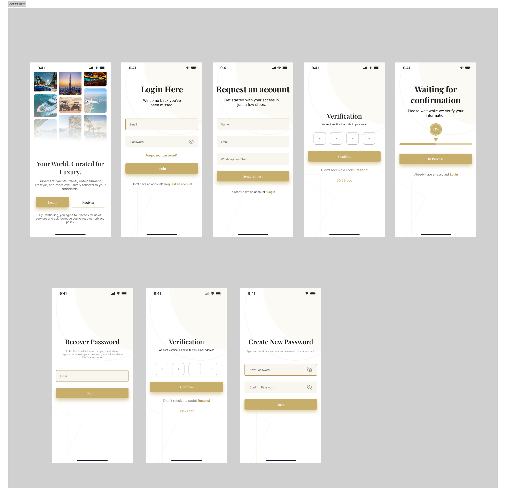

# ABYANSF - Apps Design (Flutter Implementation)

A Flutter implementation of the mobile app design from the Figma prototype.

## Figma Design Reference
[View Figma Design](https://www.figma.com/design/o1MXZksyFIAiwVt0C18jTA/abyansf_-Apps-design--Copy-?node-id=1-2&p=f&m=dev)

## Features
- Clean, modern UI following the Figma design
- Responsive layout for various screen sizes


## Screenshots
<div style="display: flex; justify-content: space-between;">
 <div>
    <h4>Onboarding Screens</h4>
    
  </div>
  <div>
    <h4>Authentication Screens</h4>
    
  </div>
  <div>
    <h4>Main Screens</h4>
    
  </div>
  <div>
    <h4>Request Form Screens</h4>
    
  </div>
  <div>
    <h4>Profile Screens</h4>
    
  </div>
</div>


## 🎥 Demo Video

<div align="center">
  <a href="https://youtu.be/RMSVA2R2iXQ">
    
  </a>
  <br>
  <a href="https://youtu.be/RMSVA2R2iXQ" target="_blank">Watch on YouTube</a>
</div>

## Getting Started

### Prerequisites
- Flutter SDK (version 3.0.0 or higher)
- Dart (version 2.17.0 or higher)
- Android Studio/VSCode with Flutter plugin

### Installation
1. Clone this repository
   ```bash
   git clone https://github.com/robiulsunnyemon/abyan.git
   ```
2. Navigate to the project directory
   ```bash
   cd abyansf-flutter
   ```
3. Install dependencies
   ```bash
   flutter pub get
   ```
4. Run the app
   ```bash
   flutter run
   ```

## Project Structure
```
lib/
├── main.dart          # Main application entry point
├── screens/           # All screen widgets
├── widgets/           # Reusable custom widgets
├── models/            # Data models
├── services/          # Business logic and services
├── utils/             # Utilities and helpers
├── constants.dart     # App constants (colors, styles etc.)
└── routes.dart        # App navigation routes
```

## License
robiulsunnyemon

